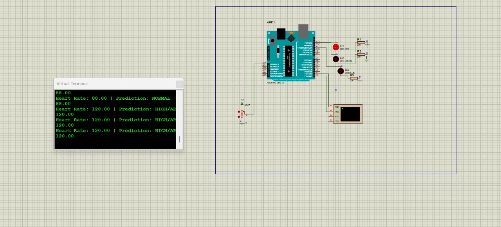

# Heart-Rate-Detector
A heart rate detection system using a pulse sensor and Arduino to measure BPM in real time.
## Objective
The objective of this project is to design a simple and low-cost heart rate monitoring system that can detect and display the user's pulse rate.
## Components Used
- Arduino Uno
- Pulse Sensor
- Breadboard
- Jumper Wires
- USB Cable
- Computer/Laptop
## Working Principle
The pulse sensor works based on photoplethysmography (PPG). It uses light to detect changes in blood volume in the fingertip. Each heartbeat causes a small change in blood flow which is detected by the sensor. The microcontroller processes this signal and calculates the heart rate in BPM.
## Circuit Diagram
The pulse sensor is connected to the analog input pin of the Arduino. The sensor reads the pulse signal and sends it to the microcontroller for processing.

## Installation
1. Connect the pulse sensor to Arduino.
2. Upload the Arduino code to the board.
4. Open the Serial Monitor in Arduino IDE.
5. Place your finger on the sensor.
6. The BPM value will be displayed.
## Applications
- Health monitoring
- Fitness tracking
- Biomedical engineering projects
- Wearable devices
## Future Improvements
- Integration with mobile apps
- Wireless monitoring using Bluetooth
- Data storage for long-term health analysis
